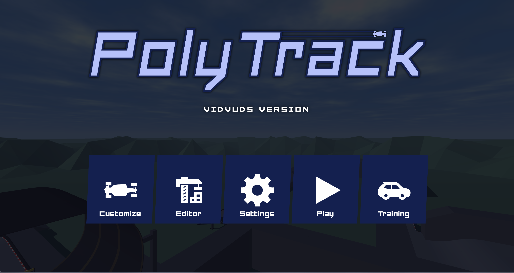
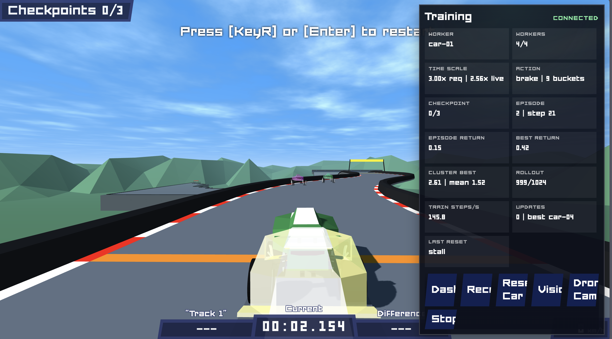
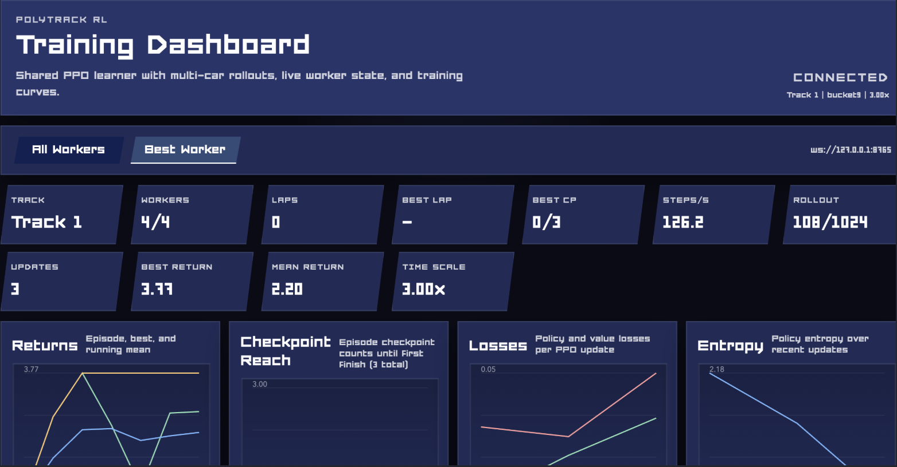

# PolyTrack AI

PolyTrack AI is my fork of PolyTrack.

The base game, track flow, and editor are still the original PolyTrack idea, but this fork adds my own training AI lab so I can run learning experiments directly against the browser game.

## What Is In This Fork

- The original PolyTrack-style driving game and track tools
- A browser-connected training mode for running multiple workers in parallel
- A Python PPO training loop with a live dashboard in [`training/`](training/)
- A cleaner asset layout with fonts in [`fonts/`](fonts/) and models in [`models/`](models/)

## Training AI Lab

The training system keeps the driving runtime in the browser and runs the learner in Python with PyTorch.

Quick start:

```bash
python -m pip install -r training/requirements.txt
python -m training
```

Then open the game, choose `Training`, pick a track, and start a run.

More detail lives in [`training/README.md`](training/README.md).

## Project Layout

- [`training/`](training/): trainer server, PPO code, dashboard, and browser training runtime
- [`tracks/`](tracks/): track data
- [`models/`](models/): 3D assets
- [`fonts/`](fonts/): font assets
- [`css/`](css/): UI styles
- [`dist/`](dist/): built frontend runtime


### Main Menu



### Training Mode



### Dashboard




## Notes

This repo is meant to stay close enough to PolyTrack to feel familiar, while also being a personal sandbox for training agents, testing track behavior, and iterating on the in-browser AI workflow.
